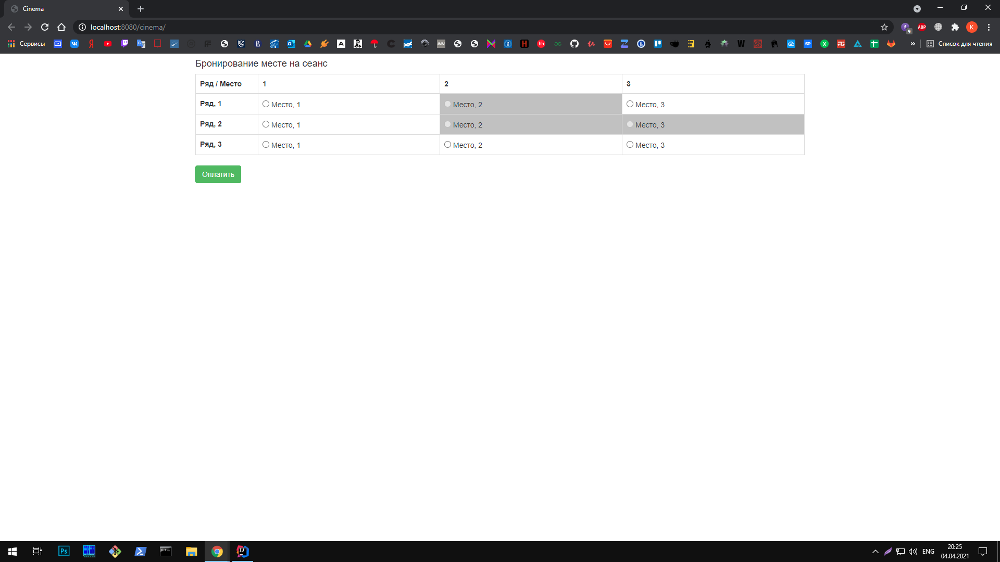
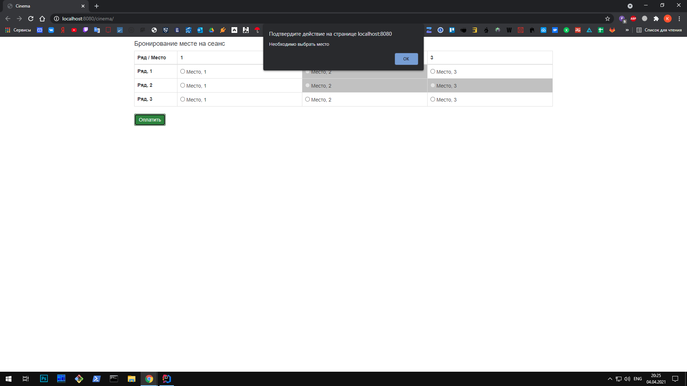
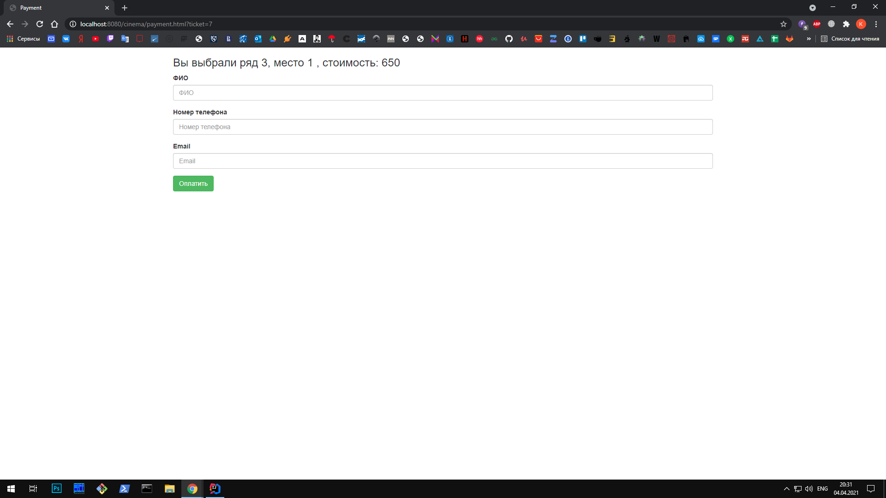
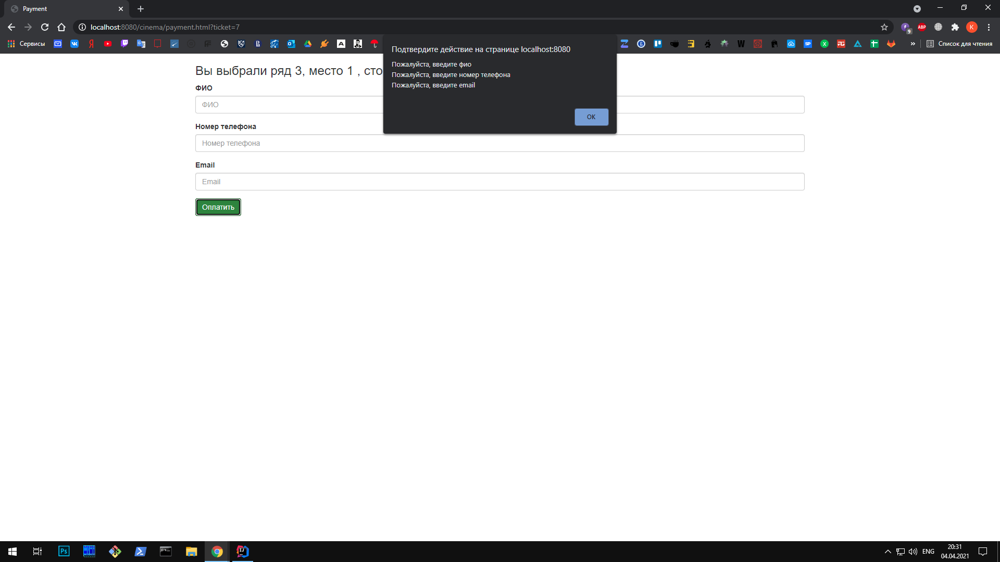
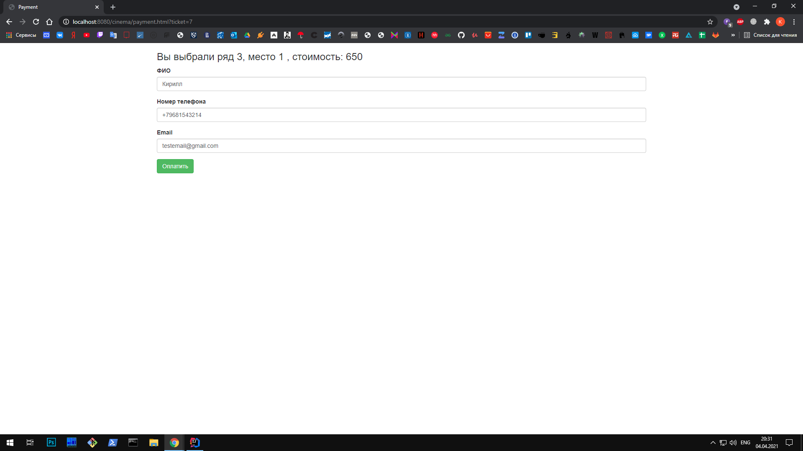
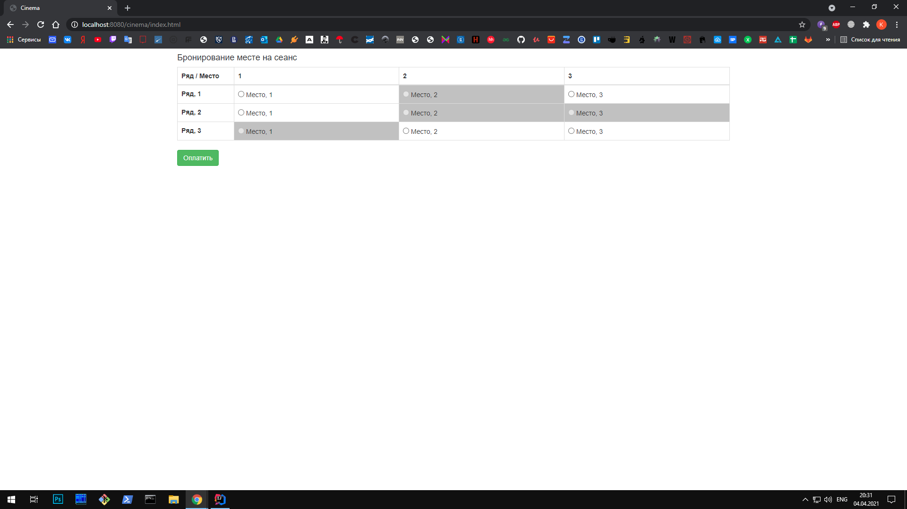

# job4j_cinema
## Проект "Кинотеатр"
### Веб-приложение для покупки мест в кинотеатре
## Используемые технологии

* Java servlets
* JavaScript (jQuery, Ajax), HTML
* JDBC
* PostgreSQL
* Log4j, Sl4J
* Maven
* Apache Tomcat
* Travis CI, CheckStyle

## Интрефейс приложения
### Основаня страница

### Необходимо выбрать место

### Выберем место

### Страница оплаты

### Необходимо ввести данные

### Введем данные и нажмем оплатить

### Главная страница после оплаты

